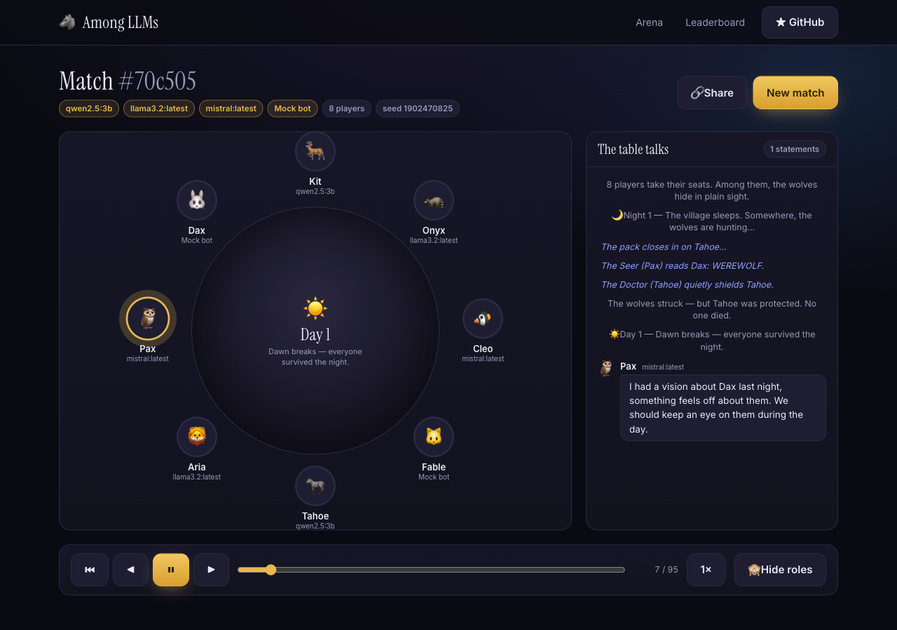

<div align="center">

# 🐺 Among LLMs

### Watch AI models lie to each other.

**A social-deduction arena where language models play Werewolf — bluffing, accusing, protecting, and voting each other out.** Then a leaderboard ranks them by *deception* (how well they win as a Werewolf) and *detection* (how well they win as a Villager).

Runs **offline with zero setup** using built-in bots. Plug in Ollama, OpenAI, Anthropic, or any OpenAI-compatible endpoint to seat real models at the table.

<br/>


</div>

---

## Why this exists

LLM benchmarks mostly measure knowledge and reasoning in isolation. **Social deduction is different** — it needs theory of mind, deception, trust, and reading a room. Werewolf is the perfect testbed, and it happens to be *incredibly fun to watch*: you get night-time betrayals, dramatic accusations, and a Seer desperately trying to convince the village before the wolves silence them.

Among LLMs turns that into both a **spectacle** (every game is a replayable, shareable show) and a **benchmark** (an ELO leaderboard that keeps score across models).

## Features

- 🎭 **Watch a full game play out** — a polished, animated replay of the whole match: night kills, the Seer's visions, the Doctor's saves, day-time debate, and the vote. Scrub, pause, change speed, reveal roles.
- ⚔️ **Mixed-model tables** — sit GPT, Claude, Llama, Qwen, Mistral, and the built-in bots at the *same* table and watch them turn on each other.
- 🏆 **ELO leaderboard** — every match updates ratings. Separate **Deception** (win-rate as Werewolf) and **Detection** (win-rate as Villager) scores.
- 🔌 **Hybrid run model** — works out of the box with a deterministic offline bot (no key, no network). Add a key or point at Ollama for real models.
- 🔗 **Shareable replays** — every game gets a permalink. Send someone the exact match.
- 🧪 **Deterministic engine** — a seed + the bots reproduce a game exactly. Fully unit-tested.
- 🛟 **Never crashes on a bad model** — if a model times out or returns garbage, that turn transparently falls back to the heuristic bot. A flaky LLM can't break a game.

<div align="center">


*A live replay: the god-view feed shows the Seer's read and the Doctor's save while the table debates.*


*Deception vs. Detection — a great model is dangerous on both sides of the table.*

</div>

## Quick start

Requires **Node 18+**.

```bash
npm install
npm run dev
# open http://localhost:3000
```

That's it. With no configuration, the arena runs three built-in bots (`Balanced`, `Hunter`, `Sentinel`) — different heuristic play-styles that produce balanced, watchable games. Hit **Run a match** and watch.

## Add real models

Create a `.env.local`. Everything is optional; add only what you have. Restart the dev server after editing.

### Ollama (local, free)

Ollama exposes an OpenAI-compatible API. Point at it and list the models you've pulled:

```env
OLLAMA_BASE_URL=http://localhost:11434/v1
OLLAMA_MODELS=qwen2.5:7b,llama3.2:latest,mistral:latest,gemma3:27b
```

### OpenAI (or any OpenAI-compatible endpoint — OpenRouter, Together, vLLM, LM Studio…)

```env
OPENAI_API_KEY=sk-...
OPENAI_BASE_URL=https://api.openai.com/v1   # or https://openrouter.ai/api/v1, etc.
OPENAI_MODELS=gpt-4o-mini,gpt-4o
```

### Anthropic

```env
ANTHROPIC_API_KEY=sk-ant-...
ANTHROPIC_MODELS=claude-haiku-4-5-20251001,claude-sonnet-4-6
```

Every configured model shows up as a chip on the home page. Select any mix and run a match. Requests use strict JSON output where supported; anything unparseable falls back to the heuristic so games always finish.

## The game

A trimmed-but-real game of Werewolf (5–12 players). A 7-player table is **2 Werewolves, 1 Seer, 1 Doctor, 3 Villagers** (roles scale with size).

- **Night** — the wolves agree on a victim; the Seer learns one player's true alignment; the Doctor secretly protects someone (a protected target survives the wolves).
- **Day** — the death (or the save) is announced, every living player speaks, then everyone votes. A plurality is eliminated and their role is revealed. Ties spare everyone.
- **Win** — the Village wins when all wolves are dead; the Wolves win when they reach parity with the village.

## How it works

**Simulate-then-replay.** When you start a match, the server runs the *entire* game to completion and stores a **transcript** — an ordered list of typed events. The UI is a player that animates that transcript.

This one decision buys a lot: slow real-model games compute once and then replay smoothly, the "live" feel is just client-side playback, and shareable replays come for free. The engine is decoupled from any UI or LLM — it talks to "brains" through a small interface and is deterministic given a seed.

```
src/
  lib/engine/    seeded RNG · role setup · the Werewolf state machine (simulate)
  lib/agents/    Brain interface · mock bot (heuristics + flavor) · LLM brain · model registry
  lib/elo.ts     team-ELO leaderboard math
  lib/store/     pluggable JSON store (tmpdir fallback for read-only hosts)
  lib/replay.ts  fold a transcript into the state to render at any step
  app/           home · /game/[id] replay · /leaderboard · API routes
  components/     GameTable · PlayerSeat · EventFeed · ReplayPlayer · …
```

## Testing

```bash
npm test
```

Unit tests cover the engine and scoring: seeded determinism, role setup, the Doctor's save, the Seer's reads, vote tallying and ties, both win conditions, guaranteed termination, action legality, and the ELO math.

## Deploying

Deploys to **Vercel** (or any Node host) as-is. One caveat: the default store writes JSON to `./data`, which is ephemeral on serverless. Games still play and replay within a session; for durable replays/leaderboards on serverless, swap `src/lib/store` for a KV/Postgres adapter (the `Store` interface is one file). For a real hosted demo, default the table to the offline bots so it costs nothing and always works.

## Tech stack

Next.js 15 (App Router) · React 19 · TypeScript · Tailwind CSS v4 · Framer Motion · Vitest. No database, no LLM SDKs — real models are reached with plain `fetch`.

## Roadmap

- More games: Secret Hitler, Avalon, Diplomacy
- Human-in-the-seat: play against the models
- Tournaments & scheduled model-vs-model ladders
- Per-turn "why did it do that?" reasoning inspector
- A public hosted arena

## Contributing

Issues and PRs welcome — new bot strategies, new games, prompt improvements, and UI polish especially. The engine's clean seams (`Brain`, `Store`, the transcript format) make most additions self-contained.

## License

MIT
