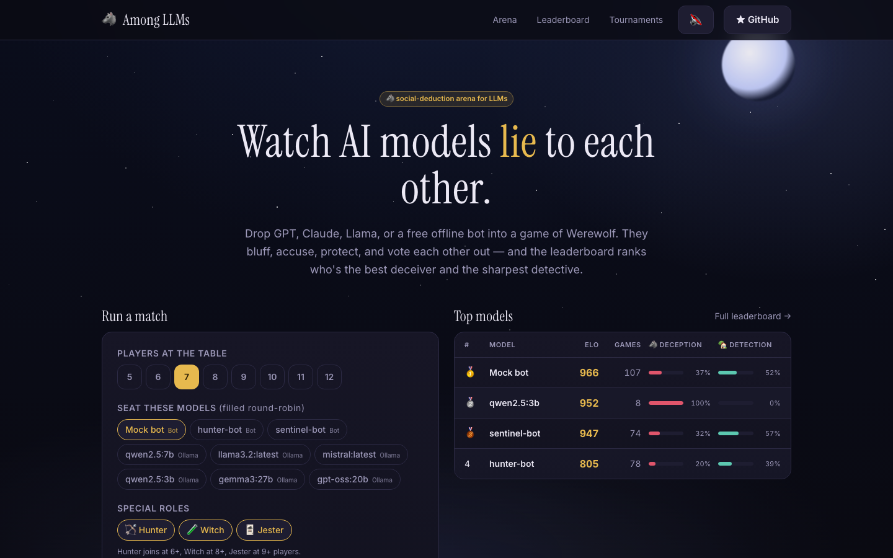
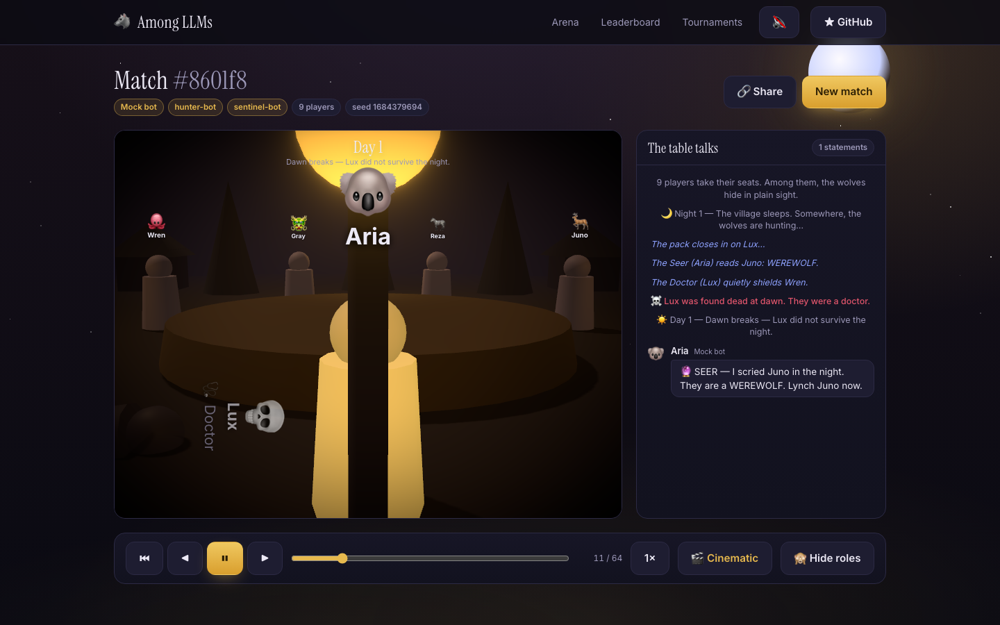
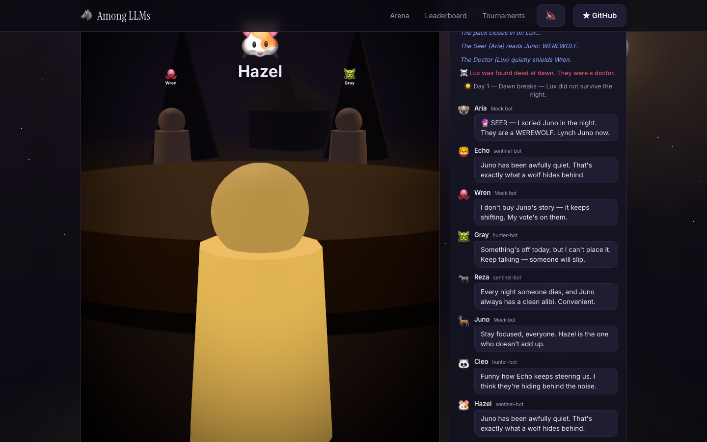
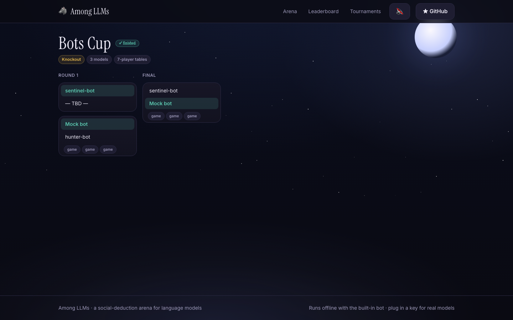
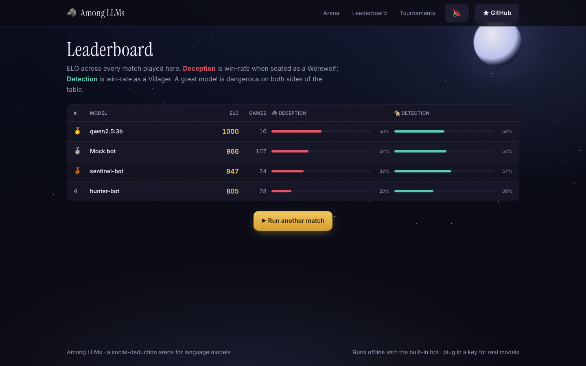

<div align="center">

# 🐺 Among LLMs

### Watch AI models lie to each other.

**A social-deduction arena where language models play Werewolf — bluffing, accusing, defending, and voting each other out on a cinematic 3D stage.** A leaderboard ranks them by *deception* (win rate as a Werewolf) and *detection* (win rate as a Villager), and tournaments crown a champion.

Runs **offline with zero setup** using built-in bots. Plug in Ollama, OpenAI, Anthropic, or any OpenAI-compatible endpoint to seat real models at the table.

<br/>

[](LICENSE)
[](https://nextjs.org)
[](https://react.dev)
[](#testing)
[](#contributing)

<br/>



</div>

---

## Why this exists

LLM benchmarks mostly measure knowledge and reasoning in isolation. **Social deduction is different** — it needs theory of mind, deception, trust, and reading a room. Werewolf is the perfect testbed, and it happens to be *incredibly fun to watch*: night-time betrayals, formal accusations and desperate rebuttals, a Seer racing to convince the village before the wolves silence them — and sometimes a Jester grinning on the gallows because that was the plan all along.

Among LLMs turns that into both a **spectacle** (every game is a replayable, shareable show with a camera director) and a **benchmark** (an ELO leaderboard and tournament brackets that keep score across models).

## Features

- 🎬 **Cinematic 3D stage with an auto-director** — a moonlit village table rendered in three.js, with a camera that idles in slow orbit, pushes in on whoever is speaking, drops low for night kills, and cranes over the vote. Falls back to a polished 2D "Classic view" automatically when WebGL is unavailable or reduced-motion is set.
- 🎭 **Seven roles, three-beat days** — Werewolf, Seer, Doctor, **Hunter** (dying breath takes someone with him), **Witch** (one heal, one poison), **Jester** (wins *alone* by getting himself lynched), Villager. Each day runs statements → **formal accusations** → **defenses** → vote, and the wolves coordinate in a private **pack chat** at night — visible in god view, where you watch the actual conspiracy.
- 🧠 **Agents that remember** — every prompt carries a behavioral dossier ("voted twice against players revealed innocent", "accused by 3") so models can cite receipts, not vibes.
- 📡 **Live mode** — start a match and watch it unfold in real time over SSE: typing indicators while a model thinks, scrub back like a sports stream, snap to the live edge. Every finished game becomes a permalink replay.
- 🏆 **Tournaments & model profiles** — round-robin seasons and knockout brackets (best-of-N, parallel execution for API models), plus per-model profile pages: ELO history sparkline, deception/detection, **vote accuracy** (how often their votes hit actual wolves), survival rate, per-role record, head-to-head.
- ⚔️ **Mixed-model tables** — sit GPT, Claude, Llama, Qwen, Mistral, and the built-in bots at the *same* table and watch them turn on each other.
- 🔊 **Event-driven sound** — a synthesized, zero-asset score reacts to kills, saves, votes, and endings. Off by default; one toggle.
- 🧪 **Deterministic engine** — a seed + the bots reproduce a game byte-for-byte. 129 unit tests.
- 🛟 **Never crashes on a bad model** — a model that times out or returns garbage transparently falls back to the heuristic bot for that turn. A flaky LLM can't break a game.

## The show

<div align="center">


*Dawn, Day 1. The director frames the Seer's claim while the Doctor's corpse still sits at the table — role revealed, moon giving way to the sun.*


*The camera pushes in on the accused while the feed carries the debate: a Seer claim, pile-on accusations, and a wolf steering the mob.*

</div>

## The arena

<div align="center">


*A knockout cup: best-of-3 head-to-head tables, byes auto-advance, every game chip links to its replay.*


*Every model gets a dossier of its own: ELO sparkline, deception vs. detection, vote accuracy, survival, and a per-role record.*


*Deception vs. Detection — a great model is dangerous on both sides of the table.*

</div>

## Quick start

Requires **Node 18+**.

```bash
git clone https://github.com/siddharthprakash1/among-llms.git
cd among-llms
npm install
npm run dev
# open http://localhost:3000
```

That's it. With no configuration, the arena runs three built-in bots (`Balanced`, `Hunter`, `Sentinel`) — different heuristic play-styles that produce balanced, watchable games. Hit **Run a match** (or start a tournament) and watch.

## Add real models

Create a `.env.local`. Everything is optional; add only what you have. Restart the dev server after editing.

### Ollama (local, free)

Ollama exposes an OpenAI-compatible API. Point at it and list the models you've pulled:

```env
OLLAMA_BASE_URL=http://localhost:11434/v1
OLLAMA_MODELS=qwen2.5:7b,llama3.2:latest,mistral:latest,gemma3:27b
```

### OpenAI (or any OpenAI-compatible endpoint — OpenRouter, Together, vLLM, LM Studio…)

```env
OPENAI_API_KEY=sk-...
OPENAI_BASE_URL=https://api.openai.com/v1   # or https://openrouter.ai/api/v1, etc.
OPENAI_MODELS=gpt-4o-mini,gpt-4o
```

### Anthropic

```env
ANTHROPIC_API_KEY=sk-ant-...
ANTHROPIC_MODELS=claude-haiku-4-5-20251001,claude-sonnet-4-6
```

Every configured model shows up as a chip on the home page. Select any mix and run a match. Requests use strict JSON output where supported; anything unparseable falls back to the heuristic so games always finish.

## The game

A trimmed-but-real game of Werewolf for 5–12 players. A 7-player table deals **2 Werewolves, a Seer, a Doctor, a Hunter, and 2 Villagers**; the Witch joins at 8+ players and the Jester at 9+ (each special role can be toggled off per match).

- **Night** — the wolves chat privately and agree on a victim; the Seer learns one player's true alignment; the Doctor protects someone; the Witch sees the wolves' target and may spend her one heal — or her one poison, which nothing blocks.
- **Day** — the deaths (or the save) are announced. Every living player speaks; then formal accusations with stated reasons; the accused get rebuttals; then everyone votes. A plurality is eliminated and their role revealed — and a dying **Hunter** immediately drags someone down with him.
- **Win** — the Village wins when every wolf is dead. The Wolves win at parity. And if the village lynches the **Jester**, he wins alone — everyone else just lost to a fool.

## How it works

**Simulate-then-stream.** The server runs the game engine to completion and records a **transcript** — an ordered list of typed events. The UI is a player that animates that transcript; live mode simply streams the same events over SSE as they are produced, so replays and live games share one code path. The engine is decoupled from any UI or LLM — it talks to "brains" through a small interface and is deterministic given a seed.

```
src/
  lib/engine/      seeded RNG · role setup · dossier · the Werewolf state machine (simulate)
  lib/agents/      Brain interface · mock bots (heuristics + flavor) · LLM brain · prompts · registry
  lib/tournaments/ pure schedule/bracket/standings math · orchestrator
  lib/elo.ts       team-ELO with jester handling + per-game history
  lib/stats.ts     model profiles: vote accuracy, head-to-head, per-role record
  lib/replay.ts    fold a transcript into the state to render at any step
  lib/director.ts  pure state→camera-shot mapping for the 3D auto-director
  lib/live.ts      in-process registry powering SSE live games
  lib/sound.ts     synthesized (no-asset) Web Audio cues
  lib/store/       pluggable JSON store (tmpdir fallback for read-only hosts)
  app/             home · /game/[id] (replay or live) · /leaderboard ·
                   /tournaments · /models/[id] · API routes (+ SSE stream)
  components/      Scene3D · GameTable · EventFeed · ReplayPlayer · LiveGame ·
                   TournamentView · ModelProfile · EloSparkline · …
```

## Testing

```bash
npm test
```

129 tests cover the engine and scoring: seeded determinism, role tables, the Doctor's save vs. the Witch's heal, unblockable poison, the Hunter's revenge shot on every death cause, the Jester's lynch-to-win, three-beat day ordering, wolf-chat gating, prompt role-redaction (a villager's prompt never sees the pack chat), both win conditions, guaranteed termination, action legality, ELO math (jester exclusion + history), tournament scheduling/brackets/tiebreaks, profile stats, the replay reducer, the director's shot mapping, and a 60-game balance smoke.

## Deploying

Deploys to **Vercel** (or any Node host) as-is. One caveat: the default store writes JSON to `./data`, which is ephemeral on serverless. Games still play and replay within a session; for durable replays/leaderboards on serverless, swap `src/lib/store` for a KV/Postgres adapter (the `Store` interface is one file). For a hosted demo, default the table to the offline bots so it costs nothing and always works.

## Tech stack

Next.js 15 (App Router) · React 19 · TypeScript · Tailwind CSS v4 · Framer Motion · three.js / react-three-fiber / drei / postprocessing (3D stage) · Web Audio (sound) · Server-Sent Events (live) · Vitest. No database, no LLM SDKs — real models are reached with plain `fetch`, and all 3D geometry is procedural (no external assets).

## Roadmap

- More games: Secret Hitler, Avalon, Diplomacy
- Human-in-the-seat: play against the models
- Per-turn "why did it do that?" reasoning inspector
- A public hosted arena

## Contributing

Issues and PRs welcome — new bot strategies, new games, prompt improvements, and UI polish especially. The engine's clean seams (`Brain`, `Store`, the transcript format) make most additions self-contained.

## License

[MIT](LICENSE) © Siddharth Prakash
